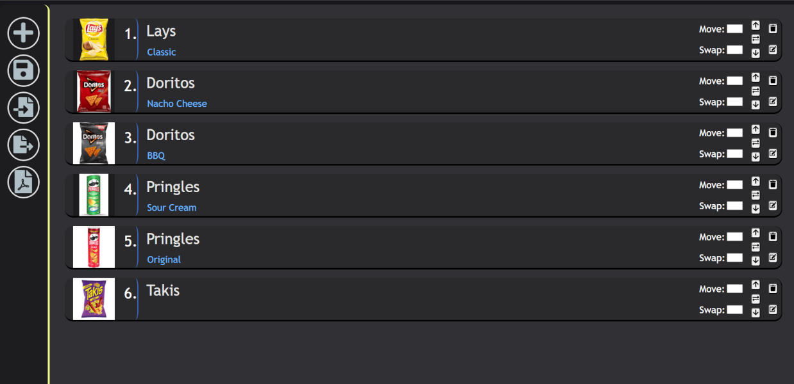
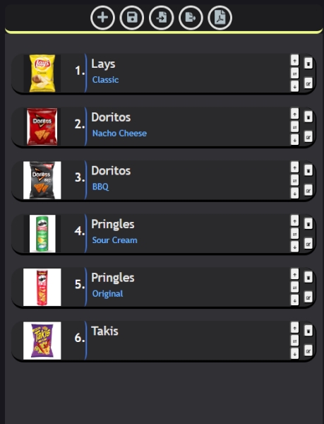
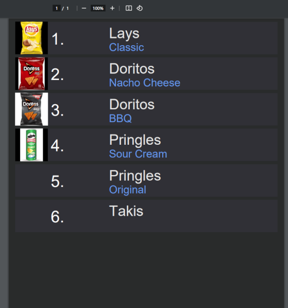

# List_Order
**Tech used:** Javascript, HTML, CSS, React

## Description
React webapp that allows users to create and order items into a list, and also import and export the list. Items can include headings, subheadings, and images.
  
 

## How to Use
To start, run `npm run dev` in folder, or start http server after building.

**Adding Items**  
Press the + button to add items to the list. The item's name, a subheading for it and an image (using web url) for it can be added. Items can be edited by pressing the edit button or deleted by pressing the delete button on the items.
  

**Reordering**  
The up and down buttons, or move to and swap inputs can be used to move items in the list. Clicking on an item selects it. Clicking the arrows on the sides with an item selected move it to that position. Clicking the swap button on another item while selecting switches the items. 
  

**Save and Export**   
The save button saves the current list to local storage, so it will be displayed when list is opened. The import from file (third) button import a list from a json file. Users can select to override current list. The export to file (forth) saves to a json file that can then be imported. The export to pdf button saves the file as a pdf (using jspdf). Some images might not work in pdf. 

